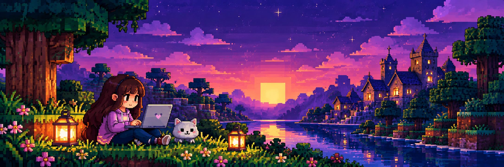

<!-- MI MUNDO PIXELADO -->

  

<!-- TEXTO ANIMADO -->

<h3>𝑻𝒉𝒆 𝒘𝒐𝒓𝒍𝒅 𝒃𝒆𝒉𝒊𝒏𝒅 𝒕𝒉𝒆 𝒔𝒄𝒓𝒆𝒆𝒏</h3>

<i>Every world begins with a single block.</i>

---

<h3 align="center">ABOUT ME</h3>

  I'm Lauuu, a Systems Engineering student 
  just beginning my journey into technology.

  I’m learning Python, programming logic and algorithms, 
  discovering how small ideas can become something real.

 

<h3 align="center">BEYOND THE PIXELS</h3>

  <code>01</code> &nbsp; Curiosity is my starting point 
  <code>02</code> &nbsp; Code is my new language 
  <code>03</code> &nbsp; Creativity is part of the process 
  <code>04</code> &nbsp; My next level is still unknown

 

<h3 align="center">CURRENTLY LEARNING</h3>

  
  
  

 

  <i>"Somewhere in the code, there's a world waiting to be discovered."</i>
    
  ✦ Chapter 01: The beginning ✦

